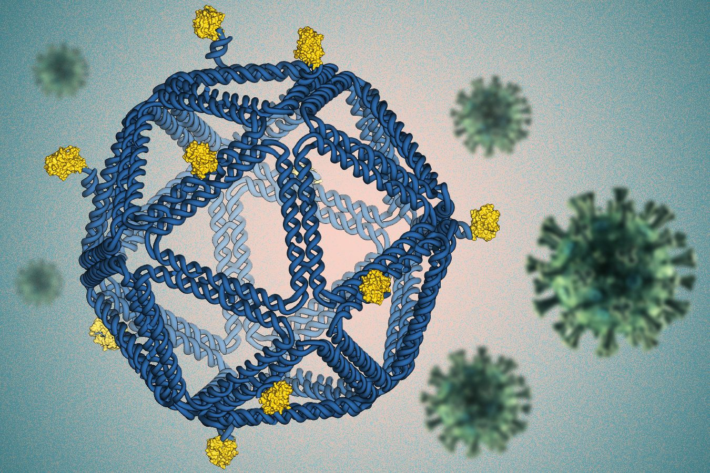

# Molecular Computing Microtalk
#### Vahagn Tovmasian, October 24 2025

---

```yaml
layout: image-right
transition: slide
dragPos:
  square: Left,Top,Width,Height,Rotate
```
# Computating and Energy 

- Greenhouse gas emissions are the primary driver of global warming and climate change. 

- Datacenters are using more energy to support increasing HPC demands.

## _PROBLEM:_ How to use less energy and still meet compute demands?
## _IDEA:_ Get inspiration from nature.

---

```yaml
layout: full
transition: slide
dragPos:
  square: Left,Top,Width,Height,Rotate
```

# The Brain As the World's Most Energy Efficient Computer

- Brain has ~86 billion neurons
- Uses about 400 kcal a day
- One med length GPT-5 query can use up to 40 Watt-hours (around 34.4168 kcal) [1]

<br> *_8% of the brain's daily energy budget on a single query_.*

<AdmonitionType title="Energy in terms of PhD Students" type="tip" width="300px" custom="text-lg" v-drag="[68,396,816,91]">
Assuming 2000 kcal a day and 10 MWh annual US household expenditure, training a 24 year old PhD student takes about <b>260 MWh</b>, compare that to 50000 MWh for GPT-5. [2]
</AdmonitionType>

---

```yaml
layout: image-right
transition: slide
dragPos:
  square: Left,Top,Width,Height,Rotate
image: adelman-figure.png
```
# Adelman and DNA 

- Directed Hamiltonian Path problem (n=6) done entirely via DNA 
- Make nodes and edges into DNA. 
- Let $v_i, v_o$ be our entry and exit nodes
  - Generate random paths, and keep paths that:
  - Begin/end at $v_i$ and $v_o$
  - Visit exactly |V| vertices
  - Enter each vertex once.
  - If any paths remain return YES, else return NO.

---

```yaml
layout: full
transition: slide
dragPos:
  square: Left,Top,Width,Height,Rotate
```

# Conclusions of Adelman's Work
- Pros: Highly energy efficient and highly parallel computation
- Cons: Extremely slow readout, setup time, and labor cost associated with it.
- Exponential growth of problem size still applies to DNA based computation.

## Can molecular computing still be useful?

---

```yaml
layout: full
transition: slide
dragPos:
  square: Left,Top,Width,Height,Rotate
```
# DNA Nanorobotics

- Program DNA 3D structure to create devices for delivering drugs, diagnostics, etc.



---

```yaml
layout: full
transition: slide
dragPos:
  square: Left,Top,Width,Height,Rotate
```
## Back to Brains: Organoid On a Chip

- Neuron clusters are being grown and integrated into silicon chips
- Potential avenue for low energy neural networks
- Great for drug design and medical research.

---

```yaml
layout: center
transition: slide
dragPos:
  square: Left,Top,Width,Height,Rotate
```

# Questions, Comments, Concerns, Quibbles?


--- 

```yaml
layout: full
```

# References
DNA Computation Figure: Adelman, Leonard Molecular Computation of Solutions to
Combinatorial Problems, Science, 1994.

[DNA Storage Figure](https://www.nature.com/articles/537022a)

[DNA Virus](https://news.mit.edu/2020/dna-origami-vaccine-design-rules-0629)

[Toehold displacement Wikipedia Article ](https://en.wikipedia.org/wiki/Toehold_mediated_strand_displacement#/media/File:Toehold_mediated_strand_displacement.png)

[Brain Organoids](https://www.sciencealert.com/swiss-startup-connects-16-human-mini-brains-to-create-low-energy-biocomputer)