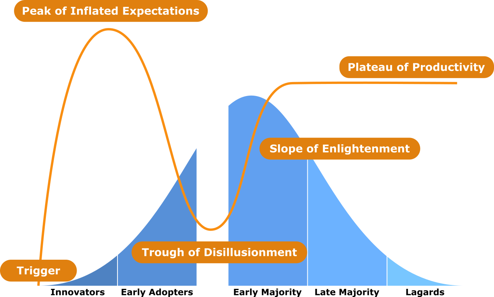

## Globalization <twemoji-globe-showing-americas />
#### Module 7: Global Impact

 

 

Christopher Martin - _Bowdoin College_ <a href="https://bowdoin.edu/" class="ns-c-iconlink"><mdi-open-in-new /></a>
<Email v="c.martin@bowdoin.edu" />

---
layout: section
color: bowdoin
---

### Throughout the semester, we have discussed how technology has impacted people

 

### Today, we are going to finish up our class content by looking at how technology impacts the world on a global scale!

 

#### ==How has technology affected workplaces?==

 

#### ==How do you think technology will affect workplaces in the coming years?==

---
layout: top-title
color: bowdoin-title
---

:: title ::

# Changing the way we work

:: content ::

# Changes, Fears, and Questions
### Introduction of technology in the workplace generates fears
- #### Mass unemployment due to increased efficiency of automated systems
- #### A need for increased skill levels & training widens the earning gap
- #### New trends generate fear and anxiety
- #### Employers use technology to monitor their employees

### ==What fears, questions, and anxieties about the rise of generative AI?==

 

### ==How do you suppose a productivity monitoring system would work?==

 

### ==Is it ethical for employers to monitor their employees? Why or why not?==

---
layout: top-title
color: bowdoin-title
---

:: title ::

# Changing Types of Work

:: content ::

# A successful technology eliminates or reduces some jobs
### but ideally should create others!

 

## Changing Skills and Skill Levels
### When you develop new technologies, you need to think about the loss of jobs and/or the ways in which they will affect the way people work

- #### As systems are more integrated into companies, developers, data analysts, and system administrators which require a technical skillset become more necessary!

- #### With the advancement of AI in new domains, jobs may require higher technical knowledge or could become more based around assisting a machine!

- #### However, companies are sometimes more willing to hire people without specific skills when they can train them quickly and use automated support systems

---
layout: section
color: bowdoin
---

### ==What are some jobs you could see be created in==
### ==the near future?==

 

### ==What are some jobs you could see be eliminated in==
### ==the near future?==

 
 

### ==How do you think this idea impacts highly skilled==
### ==workers or their salaries?==

---
layout: top-title
color: bowdoin-title
---

:: title ::

# Remote work

:: content ::

# Telecommuting
### Working at home using a computer linked to one's place of employment

 

### Advancements in technology and changes in social standards allowed "working remote" to become more common
#### About 37% of Americans did some telework even before the pandemic

- Reduces overhead for employers
- Reduces need for large offices and can help customers be more involved
- Employees can be more productive, satisfied, and loyal
- Reduces traffic congestion, pollution, gasoline use, and stress
- Reduces expenses for commuting and renting office space
- Allows work to continue during/after blizzards, hurricanes, pandemics, etc

---
layout: top-title
color: bowdoin-title
---

:: title ::

# Problems with Telecommuting

:: content ::

- Employers see resentment from those who have to / don’t work at the office
- For some telecommuting employees, corporation loyalty weakens
- Can lead to odd work hours
- Cost for office space and office supplies is shifted to the employee
- Security risks when work and personal activities reside on the same computer
- Threatens managers’ control and authority
- Makes face-to-face meetings with customers impossible
- Team meetings can become more difficult to schedule
- Teleworkers are less visible or can find themselves "out of the loop"

---
layout: top-title
color: bowdoin-title
---

:: title ::

# Employee Tracking

:: content ::

### Legitimate uses for training, measuring or increasing productivity, checking compliance with rules for communication, and detecting behavior that threatens the employer in some way

- #### Some companies block specific sites (e.g. adult content, sports sites, job search sites, social-network sites)
- #### Concerns over security threats such as viruses and other malicious software
- #### Concerns about inappropriate activities by employees (e.g., harassment, unprofessional comment)

 

### Roughly half of major companies in U.S. monitor the email, voicemail, and internet use of their employees on company systems

---
layout: top-title
color: bowdoin-title
---

:: title ::

# Law and Employee Monitoring

:: content ::

### Electronic Communications Privacy Act (ECPA) prohibits interception of email and reading stored email without a court order, but makes an exception for business systems

 

#### Courts put heavy weight on the fact that computers, email, and phone systems are owned by the employer who provides them for business purposes
- Courts have ruled against monitoring done to snoop on personal and union activities or to track down whistle blowers
- Court decisions depend on whether an employee had a reasonable "expectation of privacy"

#### Many employers have privacy policies regarding email, voicemail, and internet use!
##### Have you read them?

 

#### The National Labor Relation Board (NLRB) sets rules and decides cases about worker-employer relations.

---
layout: section
color: bowdoin
---

### ==How much privacy is reasonable for an employee to==
### ==expect in the workplace?==

 
 

### ==How has employee monitoring been impacted by==
### ==teleworking? Is it more necessary / justified?==

---
layout: top-title
color: bowdoin-title
---

:: title ::

# Globalization

:: content ::

## Technology has allowed businesses and organizations to operate at an international scale and develop global-levels of influence

 

### Telecommuting enables multinational levels of remote work and more people being "on duty" during more hours per day

 

## Arguments for Globalization
- #### Increased competition and enables consumers more choice
- #### It is a tried-and-true route stimulate the economy in poorer countries
  - Enables workers in poorer countries to get jobs
- #### Global jobs reduce unrest and increase stability

---
layout: top-title
color: bowdoin-title
---

:: title ::

# Globalization

:: content ::

## Arguments against Globalization
- #### Forces local workers to compete with foreigners who do not have the same wage and benefit requirements
- #### Accelerates the exodus of manufacturing and white-collar jobs from a country
- #### Can lead to workers in foreign countries being exploited

### Outsourcing
#### When a foreign company pays a local company to provide services in their local country instead of performing those tasks itself

 

### Offshoring
#### Moving business processes or services to another country, especially overseas, to reduce costs

---
layout: top-title
color: bowdoin-title
---

:: title ::

# The Digital Divide

:: content ::

## The Digital Divide
### The growing gap between underprivileged communities who don’t have access to technology and the higher-class individuals who do as well as the difference in the advancement of the technology available, as well as how accessible it is and to whom

 

## The Global Divide
### Access to technology is higher in wealthy countries where IT infrastructure is good, where technological literacy is higher, where it is culturally valued, and in English-speaking countries

 

## The Social Divide
### Access higher for young people and for well-educated people

---
layout: top-title
color: bowdoin-title
---

:: title ::

# The Digital Divide - Technological Diffusion

:: content ::

# Technological Diffusion
### The rate at which a new technology is assimilated into society

 

## Normalization model
### Group A adopts first, then Group B, finally Group C
### Eventually the use between the three groups is the same, A = B = C

 

## Stratification model
### Group A adopts first, then Group B, finally Group C
### The use between the three groups never normalizes, A > B > C forever

---
layout: top-title
color: bowdoin-title
---

:: title ::

# Normalization vs Stratification

:: content ::

---
layout: top-title
color: bowdoin-title
---

:: title ::

# Adoption Lifecycle

:: content ::

---
layout: top-title
color: bowdoin-title
---

:: title ::

# Hype Cycle and Adoption Lifecycle

:: content ::

---
layout: top-title
color: bowdoin-title
---

:: title ::

# Technological Optimists vs Pessimists

:: content ::

## Technological optimists
### Global adoption of technology will follow the normalization model
#### Technology will reduce poverty in developing countries and lead to greater opportunities elsewhere

 

## Technological pessimists
### Adoption of technology will follow the stratification model, leading to a permanent condition of "haves" and "have nots"
#### Technology will exacerbate existing inequalities between rich and poor countries and between rich and poor people within each nation

 

#### Evidence: Gap between rich and poor countries continues to grow

---
layout: section
color: bowdoin
---

# Sustainability
### Computing technology helps sustainability through aiding research but also produces more dangerous environmental waste: battery, heavy metal, etc.

 

### ==Are the tradeoffs worth it?==

---
layout: section
color: bowdoin
---

# Questions?

<twemoji-thinking-face v-drag="[813,227,96,89]" />
